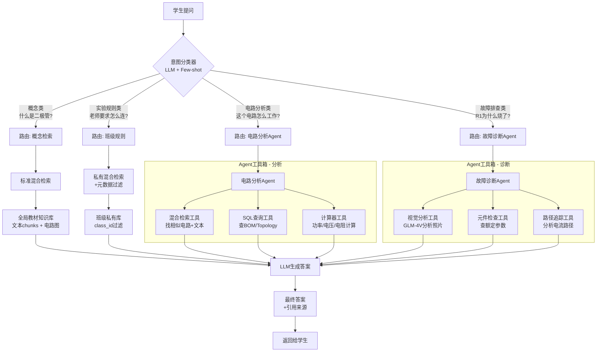

# 自适应混合代理式RAG架构设计文档

**项目**: Drawsee电路教育平台 - Phase 2 Agentic RAG
**日期**: 2025-12-16
**架构**: Router + Multi-Tool Agent + Hybrid RAG

---

## 📐 架构设计

### 整体流程



---

## 🧠 意图分类器设计

### 四大意图类别

| 意图类型 | 问题示例 | 处理策略 | 预期响应时间 |
|---------|---------|---------|-------------|
| **概念类** (CONCEPT) | "什么是基尔霍夫定律？"<br/>"二极管的工作原理" | 全局混合检索 | 1-2秒 |
| **规则类** (RULE) | "老师要求怎么连接？"<br/>"实验步骤是什么？" | 班级私有库检索 | 1-2秒 |
| **分析类** (ANALYSIS) | "这个电路是怎么工作的？"<br/>"分析三极管放大电路" | Agent+工具链 | 3-5秒 |
| **调试类** (DEBUG) | "为什么LED不亮？"<br/>"R1为什么烧了？" | Agent+工具链+视觉 | 4-8秒 |

### 分类Prompt模板

```python
INTENT_CLASSIFIER_PROMPT = """你是一个电路教育平台的意图分类专家。
根据学生的问题，判断其意图类型。

意图类型定义:
1. CONCEPT - 概念类问题
   - 询问定义、原理、理论知识
   - 例: "什么是基尔霍夫定律？"、"二极管的工作原理"

2. RULE - 规则类问题
   - 询问实验要求、操作步骤、老师布置的任务
   - 例: "老师要求怎么连接？"、"实验步骤是什么？"

3. ANALYSIS - 分析类问题
   - 询问电路工作原理、分析电路行为
   - 例: "这个电路是怎么工作的？"、"分析放大倍数"

4. DEBUG - 调试类问题
   - 询问故障原因、排查问题、实验失败原因
   - 例: "为什么LED不亮？"、"R1为什么烧了？"

学生问题: {query}

请返回JSON格式:
{{
  "intent": "CONCEPT|RULE|ANALYSIS|DEBUG",
  "confidence": 0.95,
  "reasoning": "分类依据"
}}
"""
```

---

## 🛠️ 工具链设计

### 1. 混合检索工具 (Hybrid Search Tool)

**功能**: 从Phase 2混合检索系统获取相关知识

```python
class HybridSearchTool:
    """混合检索工具 - Agent可调用"""

    async def search(
        self,
        query: str,
        knowledge_base_ids: List[str],
        search_mode: str = "hybrid",  # hybrid/circuit_only/text_only
        top_k: int = 5
    ) -> Dict[str, Any]:
        """
        执行混合检索

        Returns:
            {
                "text_chunks": [...],
                "circuit_diagrams": [...],
                "merged_results": [...]
            }
        """
```

**使用场景**: CONCEPT, RULE, ANALYSIS类问题

---

### 2. SQL查询工具 (SQL Query Tool)

**功能**: 查询电路结构化数据（BOM、topology、元件参数）

```python
class SQLQueryTool:
    """SQL查询工具 - 查询结构化电路数据"""

    async def query_circuit_bom(self, circuit_id: str) -> List[Dict]:
        """查询电路BOM (Bill of Materials)"""

    async def query_circuit_topology(self, circuit_id: str) -> Dict:
        """查询电路拓扑结构（节点、连接）"""

    async def query_component_params(self, component_type: str) -> Dict:
        """查询元件额定参数（电阻阻值、电容容值等）"""
```

**使用场景**: ANALYSIS, DEBUG类问题

---

### 3. 计算器工具 (Calculator Tool)

**功能**: 执行电路计算（欧姆定律、功率、分压等）

```python
class CalculatorTool:
    """电路计算工具"""

    def calculate_ohms_law(self, V: float = None, I: float = None, R: float = None):
        """欧姆定律: V = I * R"""

    def calculate_power(self, V: float = None, I: float = None, R: float = None):
        """功率计算: P = V * I = I^2 * R = V^2 / R"""

    def calculate_voltage_divider(self, V_in: float, R1: float, R2: float):
        """分压公式: V_out = V_in * R2 / (R1 + R2)"""

    def calculate_parallel_resistance(self, resistances: List[float]):
        """并联电阻: 1/R_total = 1/R1 + 1/R2 + ..."""
```

**使用场景**: ANALYSIS, DEBUG类问题

---

### 4. 视觉分析工具 (Vision Analysis Tool)

**功能**: 使用GLM-4V分析面包板照片、电路图

```python
class VisionAnalysisTool:
    """视觉分析工具 - GLM-4V"""

    async def analyze_breadboard_photo(
        self,
        image_url: str,
        question: str
    ) -> Dict[str, Any]:
        """
        分析面包板照片

        Returns:
            {
                "components_detected": [...],
                "connections": [...],
                "issues_found": [...],
                "analysis": "文本描述"
            }
        """

    async def analyze_circuit_diagram(
        self,
        image_url: str,
        question: str
    ) -> Dict[str, Any]:
        """分析电路图"""
```

**使用场景**: DEBUG类问题（特别是有图片上传时）

---

### 5. 元件检查工具 (Component Check Tool)

**功能**: 检查元件是否超出额定参数

```python
class ComponentCheckTool:
    """元件参数检查工具"""

    async def check_component_rating(
        self,
        component_type: str,
        component_value: str,
        actual_voltage: float = None,
        actual_current: float = None,
        actual_power: float = None
    ) -> Dict[str, Any]:
        """
        检查元件是否超出额定参数

        Returns:
            {
                "is_safe": bool,
                "rated_voltage": float,
                "rated_current": float,
                "rated_power": float,
                "warnings": [...],
                "recommendation": "建议使用更大功率的元件"
            }
        """
```

**使用场景**: DEBUG类问题（特别是"烧了"、"炸了"、"冒烟"等关键词）

---

### 6. 路径追踪工具 (Path Trace Tool)

**功能**: 分析电路中的电流路径

```python
class PathTraceTool:
    """电流路径追踪工具"""

    async def trace_current_path(
        self,
        circuit_topology: Dict,
        from_node: str,
        to_node: str
    ) -> Dict[str, Any]:
        """
        追踪从from_node到to_node的电流路径

        Returns:
            {
                "paths": [
                    {
                        "nodes": ["VCC", "R1", "LED", "GND"],
                        "components": ["R1", "LED"],
                        "total_resistance": 330.0
                    }
                ],
                "short_circuit_detected": bool,
                "open_circuit_detected": bool
            }
        """
```

**使用场景**: DEBUG类问题

---

## 🤖 Agent实现架构

### Agent基类

```python
from typing import List, Dict, Any, Optional
from abc import ABC, abstractmethod

class BaseCircuitAgent(ABC):
    """电路分析Agent基类"""

    def __init__(self):
        self.tools = self._register_tools()
        self.conversation_history = []

    @abstractmethod
    def _register_tools(self) -> Dict[str, Any]:
        """注册Agent可用的工具"""
        pass

    async def execute(
        self,
        query: str,
        context: Dict[str, Any]
    ) -> Dict[str, Any]:
        """
        执行Agent任务

        流程:
        1. LLM分析问题，决定使用哪些工具
        2. 调用工具获取信息
        3. LLM综合工具结果生成答案
        4. 返回答案+引用来源
        """
        # 第1轮: 工具选择
        tool_plan = await self._plan_tools(query, context)

        # 第2轮: 工具执行
        tool_results = await self._execute_tools(tool_plan)

        # 第3轮: 答案生成
        final_answer = await self._generate_answer(query, tool_results)

        return final_answer
```

### 电路分析Agent (Analysis Agent)

```python
class CircuitAnalysisAgent(BaseCircuitAgent):
    """电路分析Agent - 处理ANALYSIS类问题"""

    def _register_tools(self):
        return {
            "hybrid_search": HybridSearchTool(),
            "sql_query": SQLQueryTool(),
            "calculator": CalculatorTool()
        }

    async def analyze_circuit(
        self,
        query: str,
        circuit_id: Optional[str] = None,
        knowledge_base_ids: List[str] = []
    ) -> Dict[str, Any]:
        """
        分析电路工作原理

        流程示例（"分析三极管放大电路"）:
        1. 混合检索: 找到相关的放大电路图+理论文本
        2. SQL查询: 获取电路BOM和topology
        3. 计算器: 计算放大倍数、偏置电压等
        4. LLM综合: 生成分析报告
        """
```

### 故障诊断Agent (Debug Agent)

```python
class CircuitDebugAgent(BaseCircuitAgent):
    """故障诊断Agent - 处理DEBUG类问题"""

    def _register_tools(self):
        return {
            "vision_analysis": VisionAnalysisTool(),
            "component_check": ComponentCheckTool(),
            "path_trace": PathTraceTool(),
            "sql_query": SQLQueryTool(),
            "calculator": CalculatorTool()
        }

    async def diagnose_fault(
        self,
        query: str,
        circuit_id: Optional[str] = None,
        image_url: Optional[str] = None
    ) -> Dict[str, Any]:
        """
        诊断电路故障

        流程示例（"R1为什么烧了？"）:
        1. SQL查询: 获取R1的参数（阻值、额定功率）
        2. 计算器: 计算实际流经R1的电流和功率
        3. 元件检查: 对比额定功率，判断是否超出
        4. 路径追踪: 检查是否有短路路径
        5. 视觉分析（如有照片）: 分析实际连接是否正确
        6. LLM综合: 生成诊断报告+修复建议
        """
```

---

## 🔀 路由策略实现

### 路由器实现

```python
class AdaptiveRouter:
    """自适应路由器 - 根据意图选择处理策略"""

    def __init__(self):
        self.intent_classifier = IntentClassifier()
        self.naive_rag = NaiveRAGHandler()
        self.scoped_rag = ScopedRAGHandler()
        self.analysis_agent = CircuitAnalysisAgent()
        self.debug_agent = CircuitDebugAgent()

    async def route(
        self,
        query: str,
        context: Dict[str, Any]
    ) -> Dict[str, Any]:
        """
        路由入口

        Args:
            query: 用户问题
            context: 上下文信息
                - user_id: 用户ID
                - class_id: 班级ID
                - knowledge_base_ids: 知识库ID列表
                - image_url: 图片URL（可选）
                - circuit_id: 电路ID（可选）

        Returns:
            {
                "answer": "答案内容",
                "sources": [...],
                "intent": "CONCEPT",
                "tool_calls": [...],
                "confidence": 0.95
            }
        """
        # 1. 意图分类
        intent_result = await self.intent_classifier.classify(query)
        intent = intent_result["intent"]

        # 2. 根据意图路由
        if intent == "CONCEPT":
            return await self.naive_rag.handle(query, context)

        elif intent == "RULE":
            return await self.scoped_rag.handle(query, context)

        elif intent == "ANALYSIS":
            return await self.analysis_agent.execute(query, context)

        elif intent == "DEBUG":
            return await self.debug_agent.execute(query, context)

        else:
            # 默认回退到标准RAG
            return await self.naive_rag.handle(query, context)
```

---

## 📊 数据流示例

### 示例1: 概念类问题

**问题**: "什么是基尔霍夫定律？"

```
1. IntentClassifier → CONCEPT (置信度: 0.98)
2. Route → NaiveRAG
3. HybridSearch →
   - text_chunks: [
       "基尔霍夫电流定律（KCL）: 节点电流和为0",
       "基尔霍夫电压定律（KVL）: 回路电压和为0"
     ]
   - circuit_diagrams: [
       "KCL示例电路.png",
       "KVL示例电路.png"
     ]
4. LLM Generate → "基尔霍夫定律包括..."
5. Response → {answer, sources: [chunk_ids, circuit_ids]}
```

**响应时间**: ~1.5秒

---

### 示例2: 分析类问题

**问题**: "分析这个三极管放大电路的工作原理"

```
1. IntentClassifier → ANALYSIS (置信度: 0.92)
2. Route → CircuitAnalysisAgent
3. Agent决策 → [HybridSearch, SQLQuery, Calculator]
4. Tool执行:
   - HybridSearch: 找到5个相似的放大电路
   - SQLQuery: 获取BOM [Q1: 2N3904, R1: 10kΩ, R2: 4.7kΩ, ...]
   - Calculator: 计算Ib, Ic, β, Av等参数
5. LLM Synthesis →
   "该电路为共射极放大电路...
    - 静态工作点: Ic=2.1mA, Vce=6.3V
    - 放大倍数: Av≈-50
    - 输入阻抗: Zin≈3.9kΩ

    参考电路: [相似电路A.png] (来源: 模拟电子技术基础p.125)"
6. Response → {answer, sources, tool_calls}
```

**响应时间**: ~4秒

---

### 示例3: 调试类问题

**问题**: "R1为什么烧了？" + 上传面包板照片

```
1. IntentClassifier → DEBUG (置信度: 0.96)
2. Route → CircuitDebugAgent
3. Agent决策 → [VisionAnalysis, SQLQuery, Calculator, ComponentCheck]
4. Tool执行:
   - VisionAnalysis(照片): 检测到R1连接在VCC和GND之间（短路）
   - SQLQuery: R1规格 = 330Ω, 0.25W
   - Calculator: 若VCC=5V, I=5/330=15.2mA, P=I²R=0.076W (正常)
   - ComponentCheck: 检测到照片中R1直接短路, 实际P=∞ (异常!)
5. LLM Diagnosis →
   "R1烧毁原因分析:

    🔍 故障定位:
    从上传的照片可以看出，R1被直接连接在电源VCC和GND之间，
    形成短路，导致极大电流流过（理论上受限于电源内阻）。

    ⚡ 功率计算:
    - 正常情况: P = (5V)²/330Ω = 0.076W ✓
    - 短路情况: P >> 0.25W (R1额定功率) ✗

    💡 修复建议:
    1. 检查连线，R1应串联在电路中，而非直连电源
    2. 更换烧毁的R1（建议使用0.5W功率的电阻以增加余量）
    3. 重新按照电路图连接

    参考正确连接: [正确电路图.png]"
6. Response → {answer, sources, tool_calls, images}
```

**响应时间**: ~6秒

---

## 🎯 实现优先级

### Phase 1: 基础路由+标准RAG (2天)
- [x] Python混合检索API (已完成)
- [ ] IntentClassifier实现
- [ ] NaiveRAG Handler
- [ ] ScopedRAG Handler
- [ ] AdaptiveRouter基础实现

### Phase 2: Agent工具链 (3天)
- [ ] HybridSearchTool
- [ ] SQLQueryTool
- [ ] CalculatorTool
- [ ] BaseCircuitAgent
- [ ] CircuitAnalysisAgent

### Phase 3: 视觉增强 (2天)
- [ ] VisionAnalysisTool (GLM-4V集成)
- [ ] ComponentCheckTool
- [ ] PathTraceTool
- [ ] CircuitDebugAgent

### Phase 4: 前端集成 (2天)
- [ ] Java AgenticRAGService
- [ ] WorkFlow集成
- [ ] 前端多模态输入支持
- [ ] 流式响应展示

---

## 📈 性能指标

| 指标 | 目标值 | 说明 |
|------|-------|------|
| 意图分类准确率 | >95% | Few-shot + LLM |
| 概念类响应时间 | <2秒 | 标准RAG |
| 分析类响应时间 | <5秒 | Agent + 3工具 |
| 调试类响应时间 | <8秒 | Agent + 5工具 + 视觉 |
| 工具调用成功率 | >98% | 容错处理 |
| 答案准确性 | >90% | 用户反馈 |

---

**文档版本**: Agentic RAG Architecture Design v1.0
**创建时间**: 2025-12-16 02:45
**状态**: 🚧 **设计完成，准备实现**
